# Chapter 0: Configuring the GStreamer Development Environment _(2026.02.1 v1.0.0)_

**This chapter mainly introduces how to configure the GStreamer development environment on different operating systems and verify the configuration with a simple program.**

**If you already have experience configuring the GStreamer development environment, you can skip this chapter and proceed to the next one.**

**If this is your first time with GStreamer, please read this chapter carefully to ensure your development environment is configured correctly.**

---

## 🎯 Chapter Objectives

By the end of this chapter, you will be able to:

1.  Correctly install GStreamer on Windows/Linux/macOS systems
2.  Configure necessary environment variables and dependencies
3.  Use CMake to build a project containing GStreamer
4.  Write and run a simple GStreamer program

## 📚 Table of Contents

- [🪟 Configuring GStreamer Development Environment on Windows](#-configuring-gstreamer-development-environment-on-windows)
- [🐧 Configuring GStreamer Development Environment on Linux](#-configuring-gstreamer-development-environment-on-linux)
- [🍎 Configuring GStreamer Development Environment on macOS](#-configuring-gstreamer-development-environment-on-macos)
- [🔧 Integrating GStreamer into a CMake Project](#-integrating-gstreamer-into-a-cmake-project)
- [👋 Writing and Running a Hello GStreamer Program](#-writing-and-running-a-hello-gstreamer-program)
- [❓ Frequently Asked Questions](#-frequently-asked-questions)
- [📝 Summary](#-summary)

---

## 🪟 Configuring GStreamer Development Environment on Windows

### Installing GStreamer

#### 1. Visit the GStreamer official website's [Download Page](https://gstreamer.freedesktop.org/download/)


#### 2. Select the appropriate installer for your system.

> 💡 **Version Selection Suggestions**
> - **MSVC version**: If you are developing with Visual Studio
> - **MinGW version**: If you are developing with MinGW/GCC
> - Usually, the **MSVC 64-bit** version is recommended for compatibility with most development environments


#### 3. After downloading, run the installer as an administrator and follow the prompts:
1.  Select installation type: It is recommended to select "Install for all users"
2.  Installation path: It is recommended to use the default path (`C:\Program Files\gstreamer\1.0\msvc_x86_64`)
3.  Select components: It is recommended to select "Full installation" to ensure all necessary plugins are available


#### 4. Configuring Environment Variables

##### 4.1 Open Environment Variables Settings

Type "environment variables" in the Windows search bar and select "Edit the system environment variables".

> ⚠️ **Note**: Configuring system environment variables requires administrator privileges. If you cannot modify system variables, you can configure user environment variables; the method is similar.

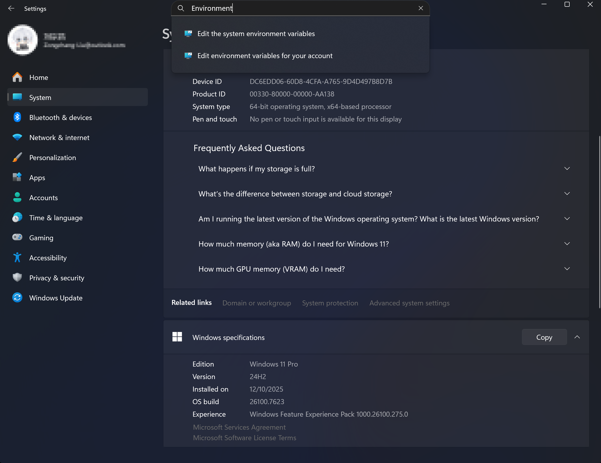

##### 4.2 Edit the Path Variable

1.  Click "Environment Variables" in the "System Properties" window
2.  Select "Path" under "System variables", click "Edit"
3.  Click "New", add the path to GStreamer's bin directory

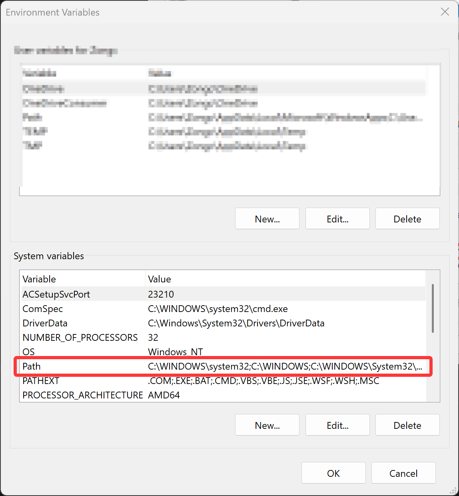

**Default Paths:**
- MSVC version: `C:\Program Files\gstreamer\1.0\msvc_x86_64\bin` (if you installed the MSVC 64-bit version)

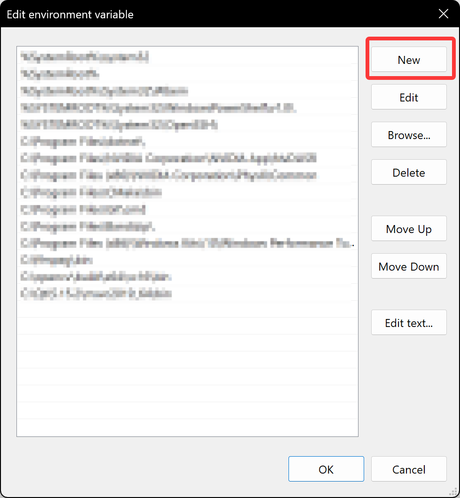

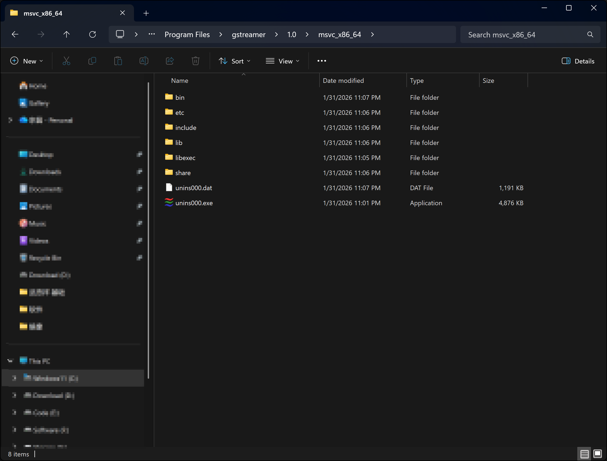

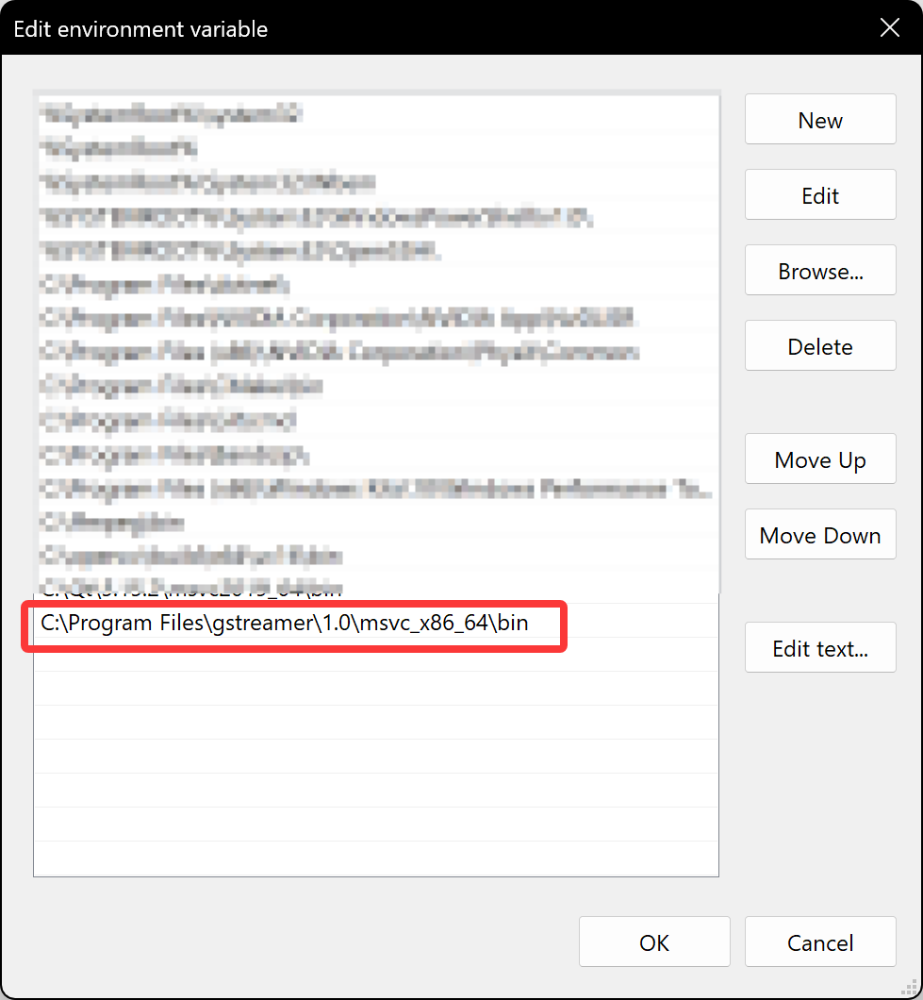

### Verifying Environment Variable Configuration

Open a **new** Command Prompt (important! needs to reload environment variables), and execute the following commands:

**Verify gst-launch-1.0 tool**
```bash
gst-launch-1.0 --version
```

If version information is displayed, the installation is successful!

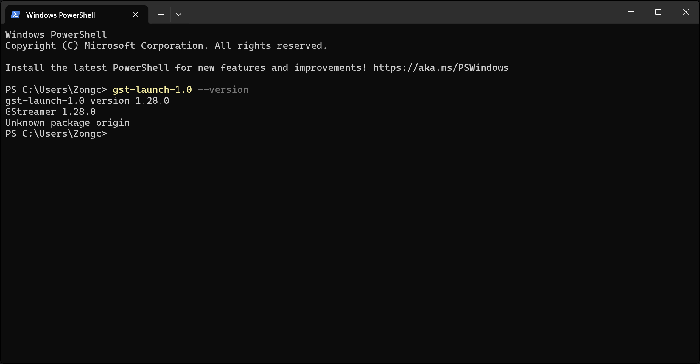

**Test video pipeline** (You should see a test pattern window)
```bash
gst-launch-1.0 videotestsrc ! autovideosink
```


**Test audio pipeline** (You should hear a test audio)
```bash
gst-launch-1.0 audiotestsrc ! autoaudiosink
```

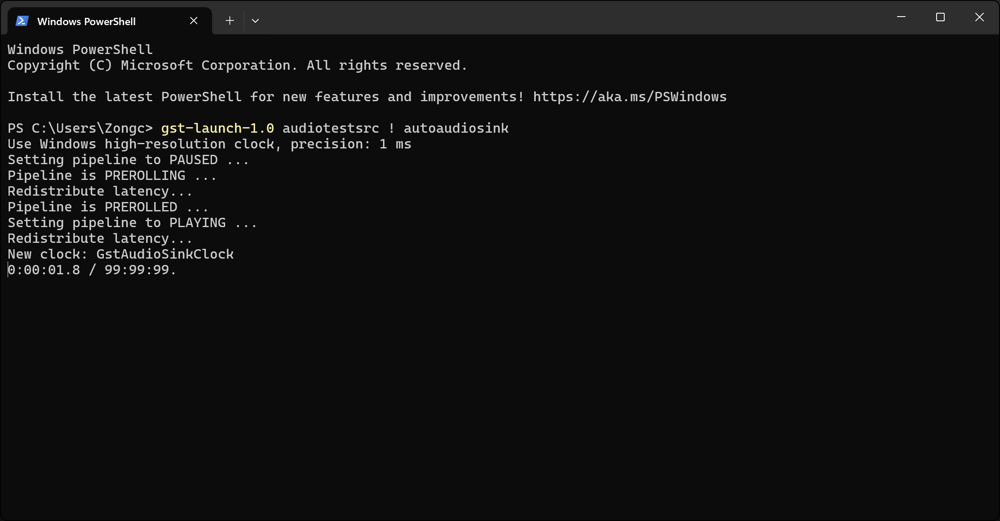

> ⚠️ **If you encounter a "command not found" error**
>
> 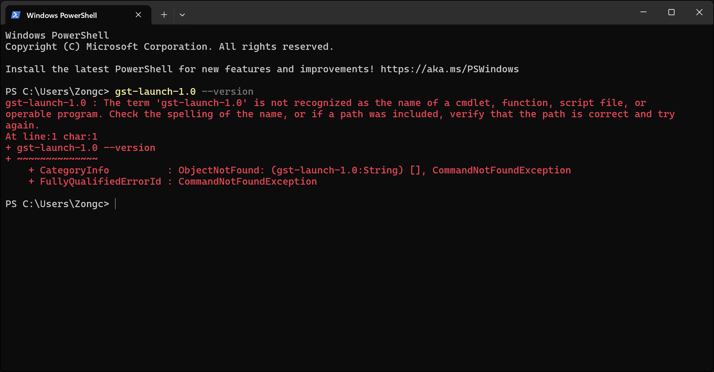
>
> **Please troubleshoot by following these steps:**
> 1. Check if the Path environment variable is configured correctly
> 2. Close all Command Prompt windows and reopen a new one
> 3. If it still doesn't work, try restarting your computer
> 4. Manually navigate to GStreamer's bin directory and execute the command to confirm the installation

> ⚠️ **Notes regarding Windows versions**
>
> Prior to version 1.28.0, the GStreamer Windows installer was split into Runtime and Development parts. Runtime contained libraries needed for runtime, while Development contained header and library files needed for development.
>
> **Starting from version 1.28.0**, GStreamer merged these two parts into a single installer, simplifying the installation process. Now, when installing GStreamer, you only need to download and install one complete package containing both Runtime and Development, eliminating the need to install them separately.

---

## 🐧 Configuring GStreamer Development Environment on Linux

### Installing GStreamer

#### Ubuntu/Debian Systems

**Update package list**
```bash
sudo apt update
```

**Install GStreamer core libraries and development files**
```bash
sudo apt install libgstreamer1.0-dev libgstreamer-plugins-base1.0-dev \
                 libgstreamer-plugins-good1.0-dev libgstreamer-plugins-bad1.0-dev \
                 gstreamer1.0-plugins-base gstreamer1.0-plugins-good \
                 gstreamer1.0-plugins-bad gstreamer1.0-plugins-ugly \
                 gstreamer1.0-libav gstreamer1.0-tools \
                 gstreamer1.0-x gstreamer1.0-alsa gstreamer1.0-gl \
                 gstreamer1.0-gtk3 gstreamer1.0-qt5 \
                 gstreamer1.0-pulseaudio
```

### Verifying Environment Variable Configuration

Open a terminal and execute the following commands:

**Verify gst-launch-1.0 tool**
```bash
gst-launch-1.0 --version
```

**Test video pipeline** (You should see a test pattern window)
```bash
gst-launch-1.0 videotestsrc ! autovideosink
```

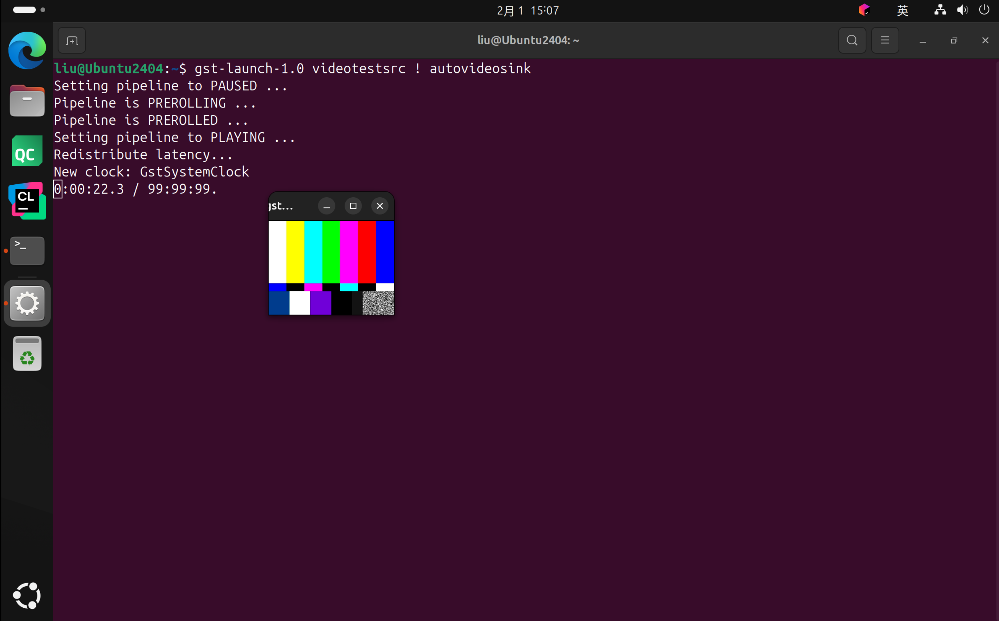

**Test audio pipeline** (You should hear a test audio)
```bash
gst-launch-1.0 audiotestsrc ! autoaudiosink
```

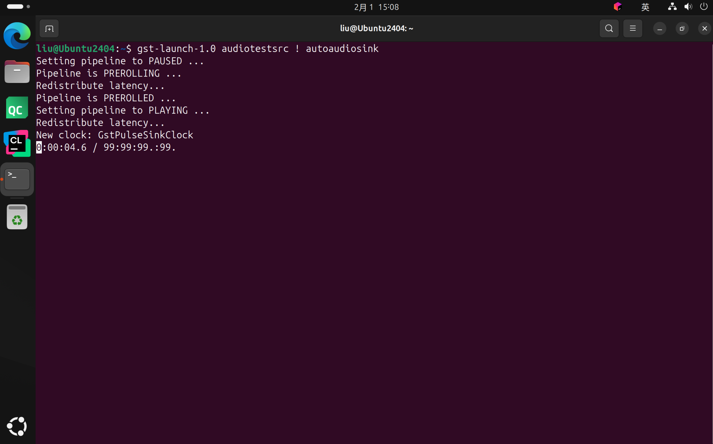

---

## 🍎 Configuring GStreamer Development Environment on macOS

### Method 1: Installing GStreamer via Package (Recommended)

#### 1. Visit the GStreamer official website's [Download Page](https://gstreamer.freedesktop.org/download/)
#### 2. Download the installer package for macOS


> ⚠️ **Notes:**
> 1. You need to choose the appropriate installer based on your macOS version; typically, the latest stable version is recommended.
> 2. **You need to install both the Runtime and Development packages.**
> 3. If you have debugging needs, you can choose to install the Debug package.

#### 3. Installing GStreamer

Double-click the downloaded `.pkg` file and follow the prompts to complete the installation. **It is recommended to use the default installation path** (`/Library/Frameworks/GStreamer.framework/Versions/1.0`).

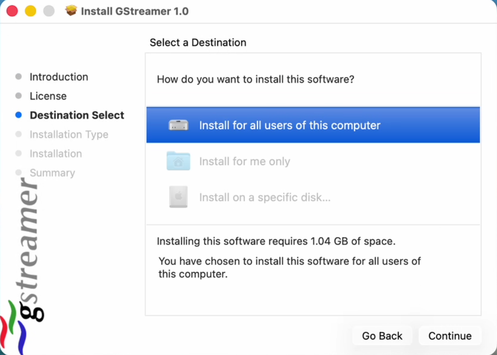

#### 4. Configuring Environment Variables

**If using Zsh:**
```bash
echo 'export GSTREAMER_DIR="/Library/Frameworks/GStreamer.framework/Versions/1.0"' >> ~/.zshrc
echo 'export PATH="$GSTREAMER_DIR/bin:$PATH"' >> ~/.zshrc
echo 'export LD_LIBRARY_PATH="$GSTREAMER_DIR/lib:$LD_LIBRARY_PATH"' >> ~/.zshrc
echo 'export PKG_CONFIG_PATH="$GSTREAMER_DIR/lib/pkgconfig:$PKG_CONFIG_PATH"' >> ~/.zshrc
```

**If using Bash:**
```bash
echo 'export GSTREAMER_DIR="/Library/Frameworks/GStreamer.framework/Versions/1.0"' >> ~/.bash_profile
echo 'export PATH="$GSTREAMER_DIR/bin:$PATH"' >> ~/.bash_profile
echo 'export LD_LIBRARY_PATH="$GSTREAMER_DIR/lib:$LD_LIBRARY_PATH"' >> ~/.bash_profile
echo 'export PKG_CONFIG_PATH="$GSTREAMER_DIR/lib/pkgconfig:$PKG_CONFIG_PATH"' >> ~/.bash_profile
```

#### 5. Applying Environment Variables
Execute the following command to apply the configuration:

**If using Zsh:**
```bash
source ~/.zshrc
```

**If using Bash:**
```bash
source ~/.bash_profile
```

### Method 2: Installing GStreamer using Homebrew

> ⚠️ **Important:**
>
> **If you have already installed GStreamer via the package method, it is recommended NOT to install it again using Homebrew to avoid version conflicts and missing plugins.**
>
> You can skip to the [Verifying Environment Variable Configuration](#verifying-environment-variable-configuration-2) section to confirm if GStreamer is installed successfully.

> 💡 **Version Selection Suggestions**
>
> Installing GStreamer via Homebrew differs from the package method. Homebrew automatically handles dependencies and provides easier version management and updates.
>
> **Note:** GStreamer installed via Homebrew might not include all plugins present in the official packages, depending on Homebrew's formula. Therefore, if specific plugins are needed, using the package installation method (Method 1) is recommended.
>
> **Summary:** If you need full GStreamer functionality, the package installation method is recommended. If you are only doing simple development and testing, the Homebrew installation method might be more convenient.

#### 1. Install Homebrew (if not already installed)
```bash
/bin/bash -c "$(curl -fsSL https://raw.githubusercontent.com/Homebrew/install/HEAD/install.sh)"
```

> ⚠️ **Note**: Users in mainland China may need to configure Homebrew mirror sources to speed up downloads. You can refer to the [Homebrew Chinese documentation](https://docs.brew.sh/Installation) to learn how to configure mirror sources.

#### 2. Installing GStreamer using Homebrew

**Option A: Install core library and common plugin packages in one go (Recommended)**
```bash
brew install gstreamer gst-plugins-base gst-plugins-good gst-plugins-bad gst-plugins-ugly gst-libav
```

**Option B: Install step-by-step (More control)**
**Install core GStreamer:**
```bash
brew install gstreamer
```

**Install base plugin set (Recommended):**
```bash
brew install gst-plugins-base
```

**Install common plugin packages:**
- **Good Plugins** - Includes common format support: autodetect, avi, flv, flac, mp3, etc.
  ```bash
  brew install gst-plugins-good
  ```
- **Bad Plugins** - Includes newer or unstable plugins: webm, mms, rsvg, etc.
  ```bash
  brew install gst-plugins-bad
  ```
- **Ugly Plugins** - Includes plugins with patent/legal issues: a52dec, mpeg2dec, x264, etc.
  ```bash
  brew install gst-plugins-ugly
  ```

**Optional plugin package installation:**
```bash
# LADSPA audio plugins
brew install gst-plugins-ladspa

# Audio processing tools
brew install gst-plugins-soundtouch

# RTSP server
brew install gst-rtsp-server

# Video processing
brew install gst-plugins-gl

# libav support
brew install gst-libav

# GStreamer development tools
brew install gst-devtools
```

### Verifying Environment Variable Configuration
> ⚠️ **Note**: Homebrew installation of GStreamer usually configures environment variables automatically. However, loading related dynamic libraries might take a long time; please be patient.

Open a terminal and execute the following commands:

**Verify gst-launch-1.0 tool**
```bash
gst-launch-1.0 --version
```


**Test video pipeline** (You should see a test pattern window)
```bash
gst-launch-1.0 videotestsrc ! autovideosink
```


**Test audio pipeline** (You should hear a test audio)
```bash
gst-launch-1.0 audiotestsrc ! autoaudiosink
```


---

## 🔧 Integrating GStreamer into a CMake Project

GStreamer 1.14+ provides CMake configuration files, making it easy to integrate GStreamer into CMake projects.

Here is a simple CMakeLists.txt example showing how to integrate GStreamer into a project. You can find the complete project in [examples/basic_examples/00-hello-gstreamer](../../examples/basic_examples/00-hello-gstreamer) and run tests.

```cmake
cmake_minimum_required(VERSION 3.25)

# Project name
set(PROJECT_NAME "hello-gstreamer")

# Set project language to C++
project(${PROJECT_NAME} LANGUAGES CXX)

# Find the PkgConfig module
find_package(PkgConfig REQUIRED)

# Use PkgConfig to find GStreamer core libraries
pkg_check_modules(GSTREAMER REQUIRED IMPORTED_TARGET
        gstreamer-1.0
        gstreamer-video-1.0
        gstreamer-audio-1.0
        gstreamer-app-1.0
)

# Use PkgConfig to find GStreamer base plugin libraries
pkg_check_modules(GSTREAMER_PLUGINS_BASE REQUIRED IMPORTED_TARGET
        gstreamer-plugins-base-1.0
)

# Add executable
add_executable(${PROJECT_NAME} main.cpp)

# Link GStreamer libraries
target_link_libraries(${PROJECT_NAME}
        PkgConfig::GSTREAMER
        PkgConfig::GSTREAMER_PLUGINS_BASE
)
```

---

## 👋 Writing and Running a Hello GStreamer Program

In the [examples/basic_examples/00-hello-gstreamer](../../examples/basic_examples/00-hello-gstreamer) directory, there is a simple Hello GStreamer program example. You can refer to the following code:

This program initializes GStreamer, prints version information, creates a simple audio-video pipeline for playback, and runs until the window is closed.

```cpp
#include <iostream>
#include <gst/gst.h>

static int main_func(int argc, char *argv[]) {
    // Initialize GStreamer
    gst_init(&argc, &argv);

    // Print Hello, GStreamer! to the console
    std::cout << "Hello, GStreamer! " << std::endl;
    std::cout << "GStreamer Version: "
            << GST_VERSION_MAJOR << "."
            << GST_VERSION_MINOR << "."
            << GST_VERSION_MICRO << std::endl;

    // Create a simple pipeline
    GstElement *pipeline = gst_parse_launch("videotestsrc ! autovideosink ! audiotestsrc ! autoaudiosink", nullptr);
    if (!pipeline) {
        std::cerr << "Failed to create pipeline." << std::endl;
        return -1;
    }

    // Start playing the pipeline
    gst_element_set_state(pipeline, GST_STATE_PLAYING);

    std::cout << "Pipeline is playing. Close the video window to exit." << std::endl;

    // Wait until error or EOS
    GstBus *bus = gst_element_get_bus(pipeline);
    GstMessage *msg = gst_bus_timed_pop_filtered(bus, GST_CLOCK_TIME_NONE,
                                                    static_cast<GstMessageType>(GST_MESSAGE_ERROR | GST_MESSAGE_EOS));

    // Parse message
    if (msg != nullptr) {
        gst_message_unref(msg);
    }

    // Clean up
    gst_object_unref(bus);
    gst_element_set_state(pipeline, GST_STATE_NULL);
    gst_object_unref(pipeline);

    return 0;
}

int main(const int argc, char *argv[]) {
#ifdef __APPLE__
    gst_macos_main(reinterpret_cast<GstMainFunc>(main_func), argc, argv, NULL);
#else
    main_func(argc, argv);
#endif
    return 0;
}
```

## ❓ Frequently Asked Questions

### Q1: After installing GStreamer, gst-launch-1.0 is not found in the command line. What should I do?
**A1:** Please confirm that the GStreamer bin directory path has been correctly added to the Path environment variable. Reopen the command line window to load the new environment variables. If the problem persists, try restarting your computer.

### Q2: When running gst-launch-1.0 command, it reports an error saying a plugin is not found. What should I do?
**A2:** Please confirm that necessary plugin packages (like good, bad, ugly, etc.) are installed. On Linux, you can use the package manager to install missing plugins. On Windows and macOS, ensure you have installed the complete GStreamer package.

### Q3: GStreamer is not found in my CMake project. What should I do?
**A3:** Please ensure that CMakeLists.txt correctly uses `pkg_check_modules` to find GStreamer libraries, and that GStreamer's pkg-config file path is included in the `PKG_CONFIG_PATH` environment variable.

### Q4: The PkgConfig module is not found. What should I do?
**A4:** Please ensure that the PkgConfig tool is installed. On Linux, you can install it using the package manager. On Windows, you can install it via MSYS2 or other methods. On macOS, Homebrew usually installs PkgConfig automatically.

---

## 📝 Summary

This chapter detailed the complete process of configuring the GStreamer development environment on Windows, Linux, and macOS systems. You learned how to:

1.  **Install the environment**: Install GStreamer and its plugins on different operating systems
2.  **Configure the environment**: Set up necessary environment variables and dependencies
3.  **Integrate into projects**: Use CMake to build a project containing GStreamer
4.  **Develop programs**: Write and run simple GStreamer applications

### Next Steps

After configuring the development environment, you can:

1.  Try modifying the example code to explore different GStreamer elements
2.  Learn to use the `gst-launch-1.0` command-line tool for quick pipeline testing
3.  Read the GStreamer official documentation to understand core concepts
4.  Proceed to the next chapter to learn about GStreamer's basic concepts and architecture

### Quick Command Reference

| Function        | Command                                       |
|-----------------|-----------------------------------------------|
| Check version   | `gst-launch-1.0 --version`                    |
| Test video      | `gst-launch-1.0 videotestsrc ! autovideosink` |
| Test audio      | `gst-launch-1.0 audiotestsrc ! autoaudiosink` |
| List elements   | `gst-inspect-1.0`                             |
| Inspect element | `gst-inspect-1.0 videotestsrc`                |

### Recommended Resources
- [GStreamer Official Documentation](https://gstreamer.freedesktop.org/documentation/)
- [GStreamer Application Development Manual](https://gstreamer.freedesktop.org/documentation/application-development/)
- [GStreamer Plugin Writer's Guide](https://gstreamer.freedesktop.org/documentation/plugin-development/)
- [GStreamer Example Code](https://gitlab.freedesktop.org/gstreamer/gstreamer/-/tree/master/subprojects/gst-plugins-base/tests/examples)

---

**If you encounter any problems:**

1.  Please refer to the **Frequently Asked Questions** section in this chapter
2.  Consult the GStreamer official documentation and community forums
3.  Submit an issue in the GitHub repository for help

**You are also welcome to contact me via Email for discussion: zongchang.smile@gmail.com**

Wishing you smooth GStreamer development!